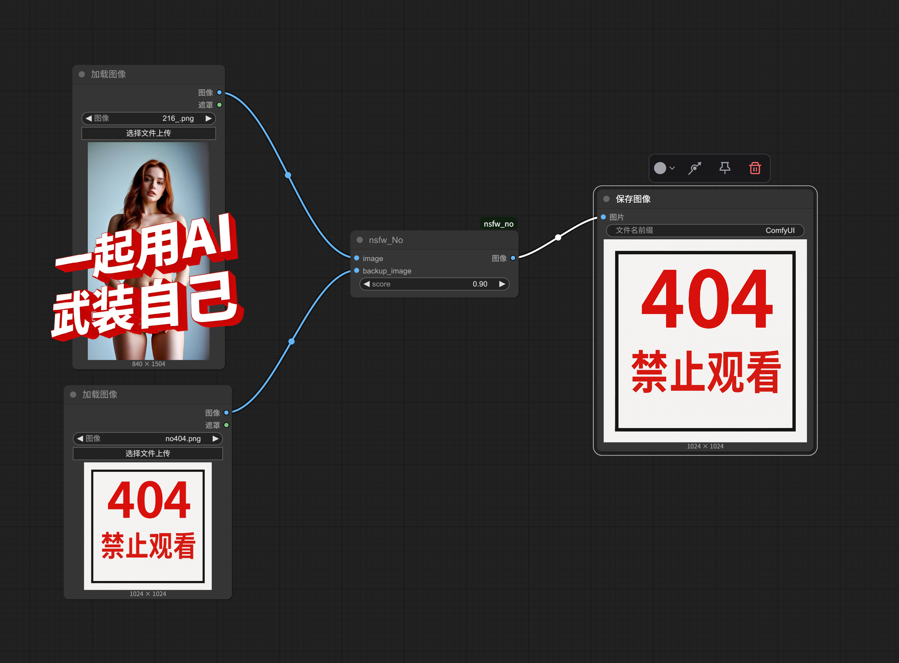
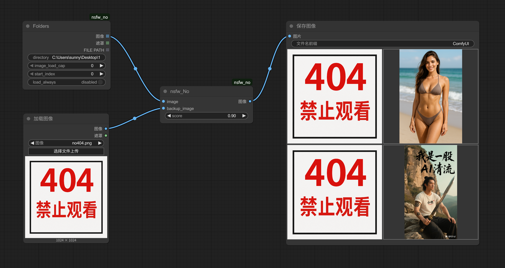

# nsfw_No— ComfyUI Custom Node

A custom node to filter or replace NSFW content in ComfyUI workflows.

> This project adds an NSFW (Not Safe For Work) detection node to ComfyUI. It flags unsafe images using a machine learning model and substitutes them with a user-defined fallback image

## 🚀 Quickstart

1. Install [ComfyUI](https://docs.comfy.org/get_started).
1. Install [ComfyUI-Manager](https://github.com/ltdrdata/ComfyUI-Manager)
1. Look up this extension in ComfyUI-Manager. If you are installing manually, clone this repository under `ComfyUI/custom_nodes`.
1. Restart ComfyUI.

## ⚙️ Usage

The model will be automatically downloaded from Hugging Face on first use.

- `image`: The input image to be classified.
- `score`: The threshold score for classifying an image as NSFW.
- `backup_image`: The fallback image to return if the input is classified as NSFW.

## 🖼️ Example

**（Workflows in example_workflows）**

## 🤝Contributing

Contributions are welcome. Please submit a pull request if you have any improvements or bug fixes.

## 📄License

This project is licensed under the terms of the MIT license.
